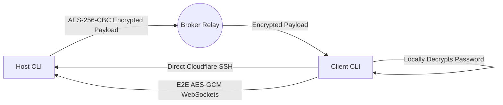

<div align="center">
  <h1>🔗 iPingYou — SecureLink CLI v2.0</h1>
  <p><strong>Military-Grade, Zero-Knowledge P2P Remote Access & Collaboration Tool</strong></p>

  [](https://www.npmjs.com/package/@miraj181/ipingyou)
  [](https://opensource.org/licenses/MIT)
  [](https://nodejs.org)
</div>

---

**iPingYou** is a zero-configuration Node.js CLI that establishes AES-encrypted, peer-to-peer SSH tunnels using Cloudflare's Edge network. Version 2.0 introduces **End-to-End Encrypted WebSockets**, **Terminal Mirroring**, **Passwordless Ephemeral Keys**, and **Background Daemonization**.

No firewalls to configure. No port forwarding. No plaintext leakage.

## ✨ God-Tier Features (New in v2.0)

* 🔐 **Ephemeral Passwordless Auth**: The Host automatically injects a temporary `Ed25519` key into `authorized_keys`. Clients connect instantly without knowing the machine's actual root/user password. Keys are purged immediately on exit.
* 💬 **E2E Web Crypto Chat Room**: A real-time, browser-based chat UI using native Web Crypto API (`AES-GCM`). Your chat keys are passed via URL fragments (`#password`) so they never touch a server—not even the Host machine's Node server!
* 📺 **Terminal Mirroring**: Wrap client SSH sessions in a multiplexed `tmux` terminal. The Host can spectate connected clients in real-time right from the dashboard to audit or assist.
* 🔄 **Reverse Port Forwarding (`ssh -R`)**: Clients can expose their *local* `localhost` development ports back to the Host through the secure tunnel.
* 📡 **Hardware Telemetry Verification**: Clients silently generate hardware footprint reports (OS, RAM, CPU, IP), encrypt them locally with the session password, and send them to the Host for authorization.
* 🚨 **Panic Kill-Switch**: Type `ipingyou panic` to instantly vaporize all associated keys, wipe all alias configs, and send a `SIGKILL` to every active tunnel and SSH shell.
* 👻 **Daemonization**: Run `ipingyou service install` to quietly install and run the Host listener in the background (survives system reboots using PM2).

---

## 🚀 Quick Start

You don't need to download any code. `iPingYou` runs natively from the global npm registry.

### The "On-the-Fly" Way (Recommended)
```bash
# Start the interactive wizard
npx @miraj181/ipingyou

# Instantly spin up your machine as a Host
npx @miraj181/ipingyou host

# Connect to a remote machine using a session UID
npx @miraj181/ipingyou connect
```

### Global Install
```bash
npm install -g @miraj181/ipingyou

# Execute globally using aliases:
ipingyou
# or
securelink
```

---

## 🔒 Zero-Knowledge Architecture

The public broker server exists solely to rendezvous connections. It is fundamentally a **"Dumb Pipe"**.



1. **Host** starts up, spawns `cloudflared` tunnels for SSH and Chat, and generates a random, offline **AES-256 Session Password**.
2. **Host** encrypts the tunnel data with the password and sends the *ciphertext* to the Broker alongside a short UID.
3. **Client** runs `ipingyou connect`, enters the UID and Password.
4. **Client** fetches the ciphertext, decrypts it locally, and connects directly via SSH and WebSockets.
5. On `Ctrl+C`, `tree-kill` initiates a graceful shutdown, revokes the UID from the broker, and scrubs `/tmp` memory.

---

## 🛡️ Security Scanner Disclaimer

Because **iPingYou** is a powerful remote administration tool with features like background daemonization (via PM2), secure shell execution (`execa`), and anti-forensics capabilities (`panic` mode), automated security scanners (such as Socket.dev or enterprise EDRs) may flag this package as a **potential risk** or **malware-like**. 

These alerts (e.g., "AI-detected potential code anomaly", "Shell access", "Network access") are **expected behavior** for a peer-to-peer tunneling utility. The source code is entirely open-source, heavily documented, and uses zero-knowledge encryption to ensure your data is safe.

---

| Tool | Required | Installation Guide |
|------|----------|--------------------|
| **Node.js ≥18** | ✅ | [nodejs.org](https://nodejs.org) |
| **`ssh`** | ✅ | Ships native on macOS/Linux. Windows: `winget install Microsoft.OpenSSH.Client` |
| **`cloudflared`** | ✅ | `brew install cloudflared` or [Download Here](https://developers.cloudflare.com/cloudflare-one/connections/connect-networks/downloads/) |
| **`tmux`** | 〰️ | *Optional*. Required on Host machine if you want to use **Terminal Mirroring**. |

*(Note: The CLI auto-detects your OS and will attempt to guide you on how to install any missing dependencies!)*

---

## 📖 CLI Command Reference

| Command | Description |
|---------|-------------|
| `ipingyou` | Interactive CLI dashboard wizard. |
| `ipingyou host` | Start hosting and exposing your local machine securely. |
| `ipingyou connect -u <UID>` | Connect directly to a specific UID. |
| `ipingyou panic` | 🚨 Self-destruct mode. Wipes configs, memory, and kills all processes. |
| `ipingyou service install` | 👻 Installs Host mode as an always-on background daemon. |
| `ipingyou service stop` | Stops and removes the background daemon. |

---

## 📜 License

[MIT License](LICENSE) © Sk Mirajul Islam

